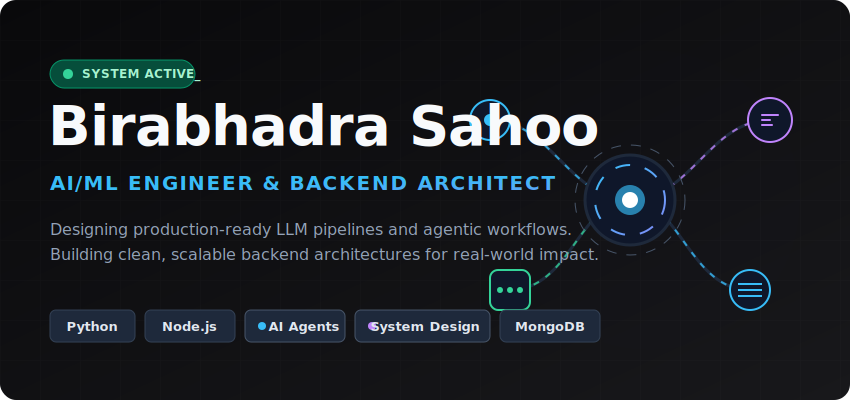

  

# 💫 About Me:
I am an AI/ML Engineer with hands-on experience in building intelligent systems using LLMs, AI agents, and scalable backend architectures. My work focuses on designing and deploying production-ready applications that combine machine learning with robust backend systems to solve real-world problems.

I have practical experience integrating large language models into applications, developing agent-based workflows, and building APIs and services that support reliable, high-performance systems. I approach problems with a strong emphasis on system design, efficiency, and clean architecture, ensuring that solutions are both scalable and maintainable.

I am particularly interested in developing end-to-end AI systems where intelligent decision-making, automation, and backend engineering come together to create impactful products.

## 🌐 Socials:
 

# 💻 Tech Stack:
                      
# 📊 GitHub Stats:
 
 

---

<!-- Proudly created with GPRM ( https://gprm.itsvg.in ) -->
